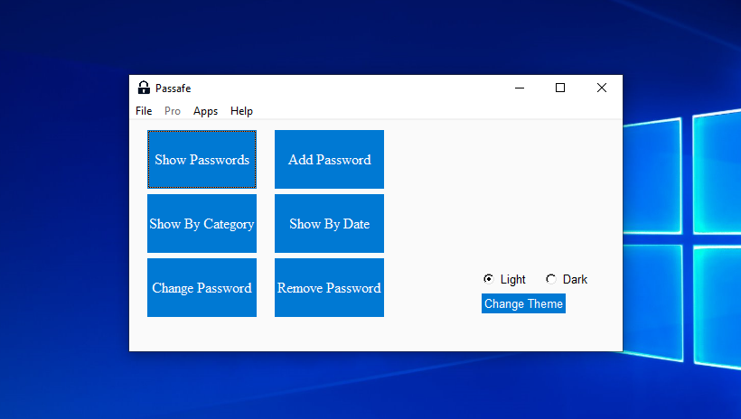

# Passafe
 ### GUI Password Saver in Python
[](./Images/Main.png "Passafe")
[More Images](./Images "More Images")

[//]: <> (<br>**Written in [PySimpleGUI](https://github.com/PySimpleGUI/PySimpleGUI "PySimpleGUI")**<br>)

### Features:
 + Name, Username, Password, Category 
 + Remove or Change Password
 + Show By Category/Date
 + CLI & GUI
 + Password Generator
 + Password Validator

### Special Features:
 + Dark Theme 
 + Email Backup
 + Backup in Drive C *(Windows Only)*
 + Auto Login
 + Open Web-Site in New Tab
 + Backup in .XLS .CSV .JSON Formats

<br>

## Installation
```shell
#Download/Clone Repository:
git clone https://github.com/Ramin-RX7/Passafe.git
#Go to Passafe Directory
cd Passafe
#Install Requirements Packages
pip install requirements.txt
#Run the App!
python Passafe.py
```

<br>
