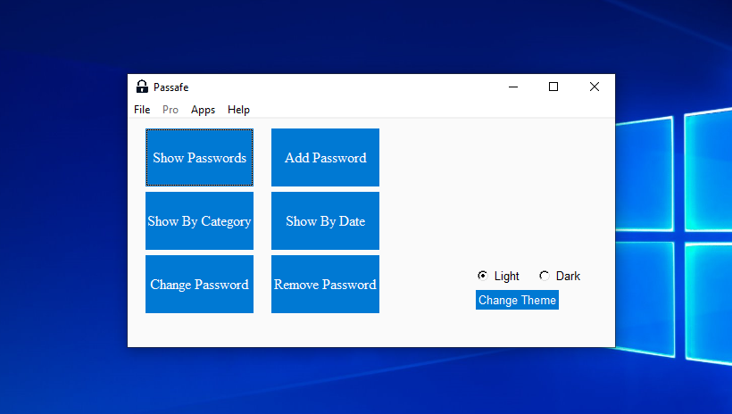

# Passafe
 ### GUI Password Saver in Python
 **Written in [PySimpleGUI](https://github.com/PySimpleGUI/PySimpleGUI "PySimpleGUI")**

### Features:
 + Name, Username, Password, Category 
 + Remove or Change Password
 + Show By Category/Date
 + CLI & GUI
 + Password Generator
 + Password Validator

### Special Features:
 + Dark Theme 
 + Email Backup
 + Backup in Drive C *(Windows Only)*
 + Auto Login
 + Open Web-Site in New Tab
 + Backup in .XLS .CSV .JSON Formats
